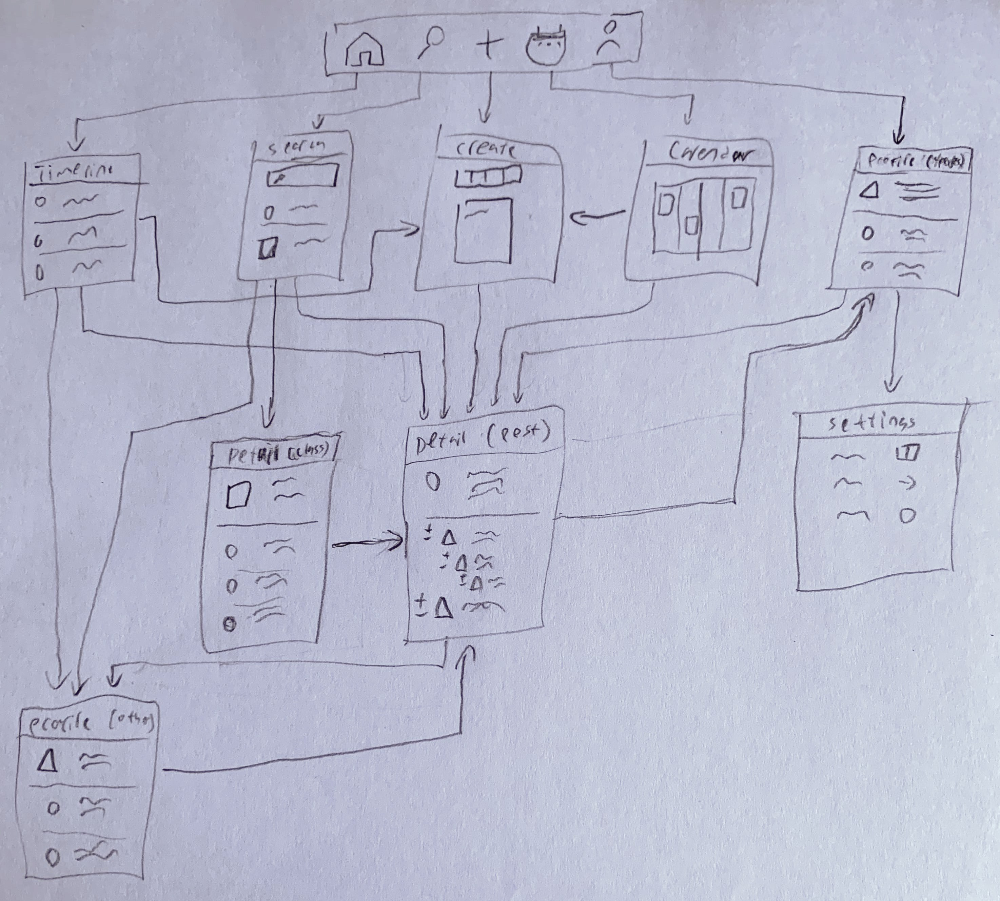

Original App Design Project
===

# Study Group Social Network App

## Table of Contents
1. [Overview](#Overview)
1. [Product Spec](#Product-Spec)
1. [Wireframes](#Wireframes)
2. [Schema](#Schema)

## Overview
### Description
Social network for college students to connect with other people taking the same classes that they are and study together. They can share important information about the class, organize study groups, and connect with their community.

### App Evaluation

- **Category:** Social Networking, Education
- **Mobile:** Users can receive notifications, use the camera to take pictures, and share data to other mobile apps.
- **Story:** Allows students to collaborate and connect with eachother
- **Market:** The market is mainly undergraduate college students, but high school, graduate, and students of all kinds could utilize the app.
- **Habit:** Students will frequently use the app to check-in with and chat with their classmates, as well as to keep updated on class materials.
- **Scope:** Initial versions would have a simple feed and allow users to post objects of different types (assignment, exam, document, study group, discussion). Some stretch goals would be more advanced data on the feed or profile and a system to use voting to verify the accuracy of information.

## Product Spec

### 1. User Stories (Required and Optional)

**Required Must-have Stories**

* User can log in
* User can sign up
* User can subscribe to specific classes
* User can create a page for a class that doesn't already have one
* User can view the feed for any class they are subscribed to
* User can post assignments and attach due date, description, and links
* User can post study groups and attach date, time, meeting room, and any other relevant info
* User can post arbitrary text/pictures
* User can comment in chains on any post
* User can vote on posts
* User can receive reminder notifications for listed deadlines
* User can edit their profile
* User can view profiles

**Optional Nice-to-have Stories**

* User can flag posts as inaccurate and have the system algorithmically determine which posts to remove from the calendar
* User can direct message other users
* User can import data from various other services
* User can automatically import class data from their university if available
* User can verify their university email 

### 2. Screen Archetypes

* Login Screen
   * User can login
* Registration Screen
   * User can sign up
   * User can verify their university email
* Stream
    * User can view the feed for any class they are subscribed to
    * User can vote on posts
* Calendar
    * User can view the feed for any class they are subscribed to (in a calendar view)
* Creation
    * User can post assignments and attach due date, description, and links
    * User can post study groups and attach date, time, meeting room, and any other relevant info
    * User can post arbitrary text/pictures
* Detail (post)
    * User can comment in chains on any post
    * User can flag posts as inaccurate and have the system algorithmically determine which posts to remove from the calendar
* Detail (class)
    * User can subscribe to specific classes
* Profile
    * User can view profiles
    * User can edit their profiles
* Settings
    * User can verify their university email 
* Search
    * User can subscribe to specific classes

### 3. Navigation

**Tab Navigation** (Tab to Screen)

* Timeline Stream
* Search
* Creation
* Calendar Stream
* Profile

**Flow Navigation** (Screen to Screen)

* Login Screen
    => Stream
* Registration Screen
    => Search
* Stream
    => Profile
    => Creation
    => Detail (post)
* Calendar
    => Creation
    => Detail (post)
* Creation
    => Detail (post)
* Detail (post)
    => Profile
* Detail (class)
    => Detail (post)
    => Profile
* Profile
    => Detail
    => Settings (if on your own profile)
* Settings
    None

## Wireframes

### [BONUS] Digital Wireframes & Mockups

Here is a [link to my Figma design](https://www.figma.com/file/VFafAvbPmBtRSPMrh3fQYV/StudyGroup?node-id=0%3A1)
Here is a [link to a PDF containing each view](./StudyGroup.pdf)
Here is a [link to the .fig file](StudyGroup.fig)

### [BONUS] Interactive Prototype

Here is the [link to the interactive prototype](https://www.figma.com/proto/VFafAvbPmBtRSPMrh3fQYV/StudyGroup?node-id=1%3A2&viewport=543%2C475%2C0.2948715090751648&scaling=scale-down)

## Schema 
[This section will be completed in Unit 9]
### Models
[Add table of models]
### Networking
- [Add list of network requests by screen ]
- [Create basic snippets for each Parse network request]
- [OPTIONAL: List endpoints if using existing API such as Yelp]
